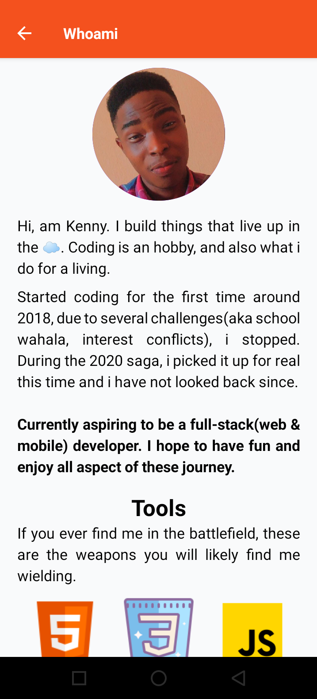
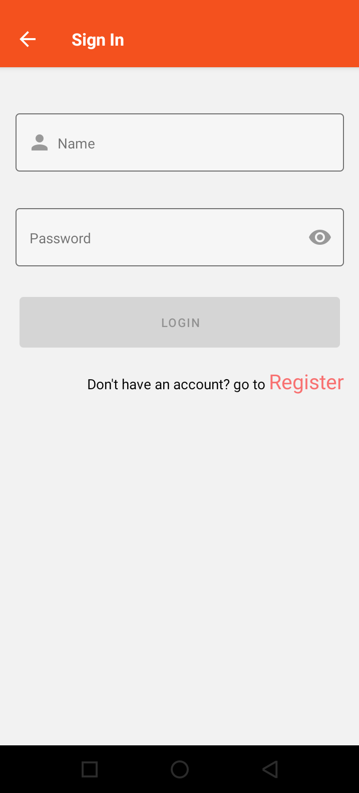
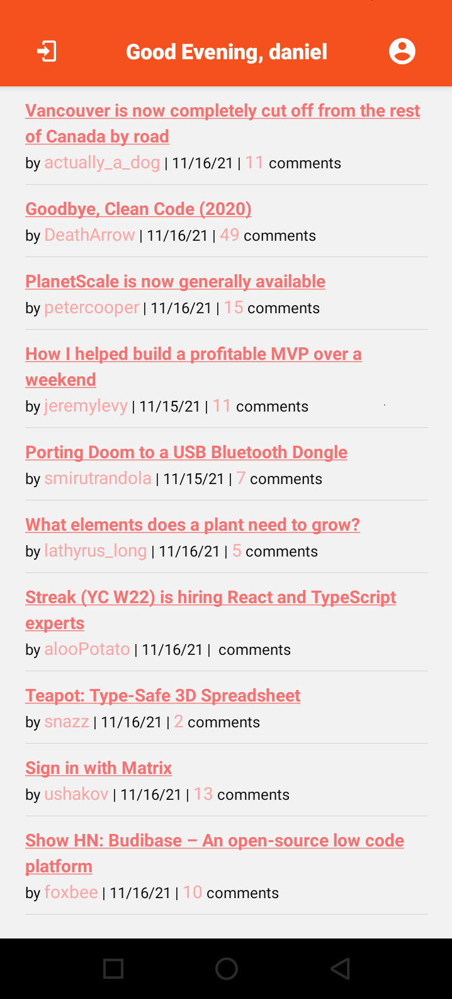
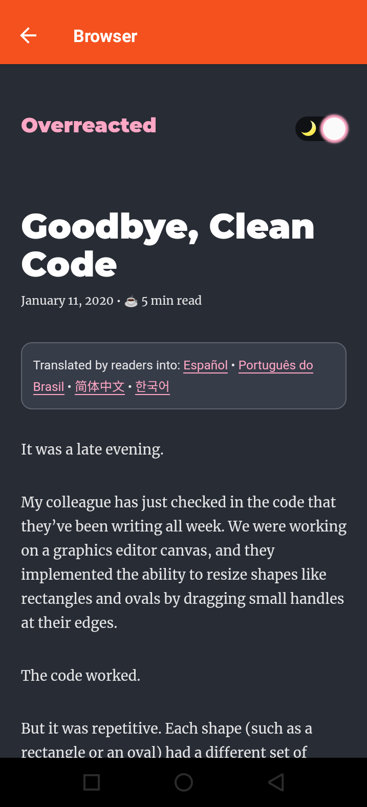

# REACT NATIVE CHALLENGE

Mobile app for the Hacker News readers made using expo.

## GETTING STARTED

- yarn install : download all dependencies needed to run the app
- yarn start : startup the app in the console and browser

## APP FEATURES

- Welcome Splash Screen

  

- About me Screen
  

  
  

- SignIn Screen

  

- News List

  

- Browser Screen
  

  

